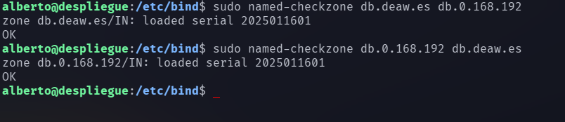

# Práctica 4.1 - Configuración de un servidor DNS

## Instalación del servidor DNS

Para configurar un servidor DNS, instalaremos los paquetes de Bind9, 
que es el servidor DNS más extendido y ampliamente utilizado. Ejecutamos el siguiente 
comando:

```console
sudo apt-get install bind9 bind9utils bind9-doc
```

## Configuración del servidor

En primer lugar le indicaremos al servidor que vamos a trabajar únicamente con IPv4, 
por lo que modificamos el archivo de configuración 'named':

```console
sudo nano /etc/default/named
```

Y la línea que comienza por 'OPTIONS' debe quedar de la siguiente manera:

```console
OPTIONS="-u bind -4"
```

### Configuración del archivo 'named.conf.options'

Antes de modificar archivos de configuración sensibles, realizamos una copia de seguridad 
con el comando: 

```console
sudo cp /etc/bind/named.conf.options /etc/bind/named.conf.options.backup
```

Ahora podemos modificarlo para que sólo se puedan hacer consultas al servidor desde 
otras máquinas de la red local. Para ello, añadimos un bloque al principio del archivo 
tal que:

```console
acl confiables {
	192.168.0.0/24;		# Red local
};
```
Y también comentamos la línea que dice "listen-on-v6 { any; };", ya que sólo vamos a 
trabajar con IPv4.

Comprobamos que la configuración es correcta con: 

```console
sudo named-checkconf
```

Reiniciamos y comprobamos el estado del servicio: 

```console
sudo systemctl restart named
sudo systemctl status named
```

Si 'named-checkconf' no ha indicado ningún problema y el servicio se encuentra en 
ejecución, podemos continuar.

### Configuración del archivo 'named.conf.local'

Ejecutamos:

```console
sudo nano /etc/bind/named.conf.local
```

Y, después del texto comentado, incluimos un bloque tal que:

```console
zone "deaw.es" {
	type master;
	file "/etc/bind/db.deaw.es";
};
```

### Creación del archivo de zona

Ahora crearemos el archivo con ruta y nombre que hemos indicado en el archivo de 
configuración anterior. En este caso:

```console
sudo nano /etc/bind/db.deaw.es
```

Y su contenido será: 

```console
$TTL 604800
@       IN      SOA     debian.deaw.es admin.deaw.es (
		2025011601 ;Serial
		3600       ;Refresh
		1800       ;Retry
		604800     ;Expire
		86400      ;Minimum TTL
	)

	IN NS debian.deaw.es.

debian IN A 192.168.0.19

```
### Creación del archivo de zona para resolución inversa

Volvemos a modificar /etc/bind/named.conf.local y añadimos:

```console
zone "0.168.192.in-addr.arpa" {
	type master;
	file "/etc/bind/db.0.168.192";
};
```

Y, al igual que en los pasos anteriores, creamos ese archivo con el contenido: 

```console
$TTL 604800
@       IN      SOA     debian.deaw.es admin.deaw.es (
		2025011601 ;Serial
		3600       ;Refresh
		1800       ;Retry
		604800     ;Expire
		86400      ;Minimum TTL
	)

	IN NS debian.deaw.es.

X IN PTR debian
```

### Comprobación de las configuraciones

Para asegurarnos de que las modificaciones y los archivos que hemos creado son correctos 
y que todo funciona correctamente, ejecutamos los siguientes comandos (en caso de que 
no haya problemas, indicarán 'OK'. En otro caso, darán información sobre el problema 
encontrado):



## Cuestiones finales

- ¿Qué pasará si un cliente de una red diferente a la tuya intenta hacer uso de tu DNS de alguna manera, le funcionará?¿Por qué, en qué parte de la configuración puede verse?

En el caso del servidor de esta práctica, el cliente de otra red no podrá acceder ya que 
en el archivo 'named.conf.options' indicamos que sólo clientes de nuestra red local podrán 
realizar peticiones a nuestro servidor DNS.

- ¿Por qué tenemos que permitir las consultas recursivas en la configuración?

Las consultas recursivas permiten que el servidor DNS resuelva nombres de dominio que no están directamente en su zona. Sin esta opción, el servidor solo respondería a consultas sobre dominios para los que es autoritativo y no buscaría información fuera de su base de datos, lo que limita su funcionalidad.

- El servidor DNS que acabáis de montar, ¿es autoritativo? ¿Por qué?

Sí, ya que posee archivos de zona para un dominio específico. 

- ¿Dónde podemos encontrar la directiva $ORIGIN y para qué sirve?

Esta directiva se encuentra en los archivos de zona y sirve para que los registros puedan 
escribirse de manera relativa a esa directiva, sin necesidad de especificar el nombre 
de dominio completo en cada uno.

- ¿Una zona es idéntico a un dominio?

No, una zona no es idéntica a un dominio, aunque están relacionados. Una zona es una porción de un dominio DNS que está bajo la administración de un servidor DNS específico, y puede incluir varios subdominios. Un dominio, por otro lado, es un nombre en el sistema de nombres de dominio (DNS).

- ¿Pueden editarse los archivos de zona de un servidor esclavo/secundario?

No, los archivos de zona de un servidor esclavo no deben ser editados manualmente. Un servidor esclavo recibe sus archivos de zona del servidor primario (maestro) y se actualiza automáticamente con los cambios.

- ¿Por qué podría querer tener más de un servidor esclavo para una misma zona?

ener múltiples servidores esclavos mejora la fiabilidad y la disponibilidad del servicio DNS. Si uno de los servidores esclavos falla, otros pueden seguir proporcionando las respuestas. 

- ¿Cuántos servidores raíz existen?

Existen 13 servidores raíz en el sistema DNS global. Estos servidores están distribuidos por todo el mundo y son responsables de redirigir las consultas DNS a los servidores de nombres autoritativos correspondientes.

- ¿Qué es una consulta iterativa de referencia?

Una consulta iterativa de referencia es un tipo de consulta DNS en la que, si un servidor DNS no tiene la respuesta a la consulta, devuelve la dirección de otro servidor DNS que podría tener la respuesta. El cliente luego consulta este servidor y repite el proceso hasta que se encuentra la respuesta.

- En una resolución inversa, ¿a qué nombre se mapearía la dirección IP 172.16.34.56?

En una resolución inversa, la dirección IP 172.16.34.56 se mapearía al nombre 56.34.16.172.in-addr.arpa. Esto se debe a que en las consultas inversas, las direcciones IP se invierten y se añaden al dominio especial in-addr.arpa.
